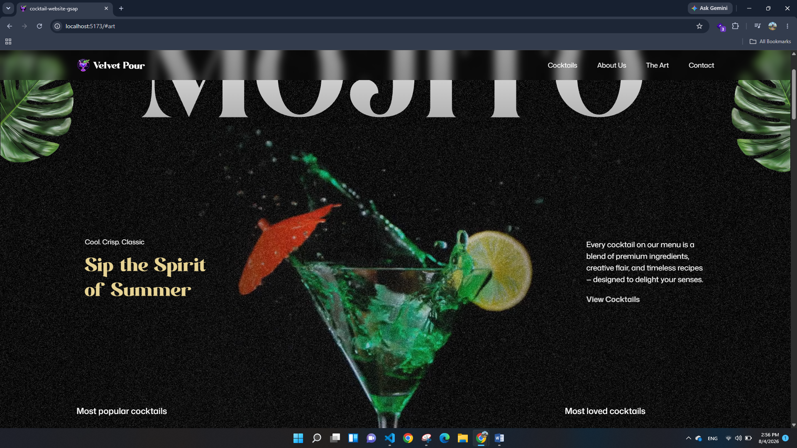
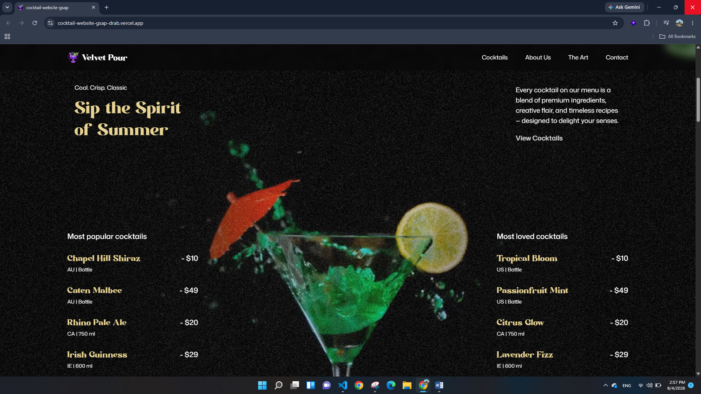

# 🍸 Cocktail Website | GSAP Animation Showcase

> A modern cocktail landing page built with **React**, **Vite**, **Tailwind CSS**, and **GSAP**.
>
> This project was created as part of my GSAP learning journey to practice advanced web animations and improve my frontend development skills.

---

## 🌐 Live Demo

🔗 https://cocktail-website-gsap-drab.vercel.app/

---

## 📸 Preview

)  

---

## 🎯 About The Project

This project is a portfolio practice focused on mastering **GSAP (GreenSock Animation Platform)**.

Rather than simply watching tutorials, I built this website to practice creating smooth, engaging user experiences with modern frontend technologies.

Throughout this project I explored how professional websites combine animations, layouts, and interactions while keeping the code organized and reusable.

The goal was to strengthen my animation skills and demonstrate that I can build visually polished interfaces using industry-standard tools.

---

## ✨ Features

- Smooth GSAP-powered animations
- Scroll-triggered effects
- Interactive cocktail carousel
- Infinite slider logic
- Dynamic content rendering
- Responsive layout
- Reusable React components
- Modern Tailwind CSS styling
- Utility-first CSS architecture
- Accessible semantic HTML

---

## 🛠 Technologies

- React
- Vite
- GSAP
- @gsap/react
- ScrollTrigger
- SplitText
- Tailwind CSS v4
- JavaScript (ES6+)

---

## 🎬 What I Practiced

During this project I worked with:

- GSAP timelines
- ScrollTrigger animations
- SplitText animations
- useGSAP hook
- Animation sequencing
- Entrance animations
- Fade, translate, scale and rotation effects
- Dynamic React state updates with animations
- Infinite carousel logic
- Component-based architecture
- Tailwind CSS utility classes
- Responsive design
- Semantic HTML & accessibility

---

## 💡 Interesting Implementation Details

### Infinite Cocktail Carousel

Implemented cyclic navigation using the remainder (`%`) operator, allowing users to continuously browse cocktails without reaching an end.

### GSAP + React

Used `@gsap/react`'s `useGSAP` hook to rerun animations whenever the active cocktail changes, creating smooth transitions between slides.

### Dynamic Content

Each cocktail updates:

- image
- title
- recipe
- description
- previous & next navigation

without page reloads.

---

## 📁 Project Structure

```text
src/
 ├── components/
 │    ├── Hero
 │    ├── About
 │    ├── Cocktails
 │    ├── Art
 │    ├── Menu
 │    ├── Footer
 │    └── Navbar
 │
 ├── App.jsx
 ├── main.jsx
 └── index.css

constants/
public/
```

---

## 🚀 Installation

```bash
git clone https://github.com/Lanssii/cocktail-website-gsap.git

cd cocktail-website-gsap

npm install

npm run dev
```

---

## 📈 Skills Demonstrated

This project demonstrates my ability to:

- Build modern React applications
- Create smooth user experiences with GSAP
- Organize reusable components
- Write clean and maintainable code
- Implement dynamic UI logic
- Work with Tailwind CSS
- Develop responsive interfaces
- Combine animation with React state management

---

## 📬 Contact

If you'd like to connect or discuss frontend opportunities:

- LinkedIn
- Portfolio
- Email
